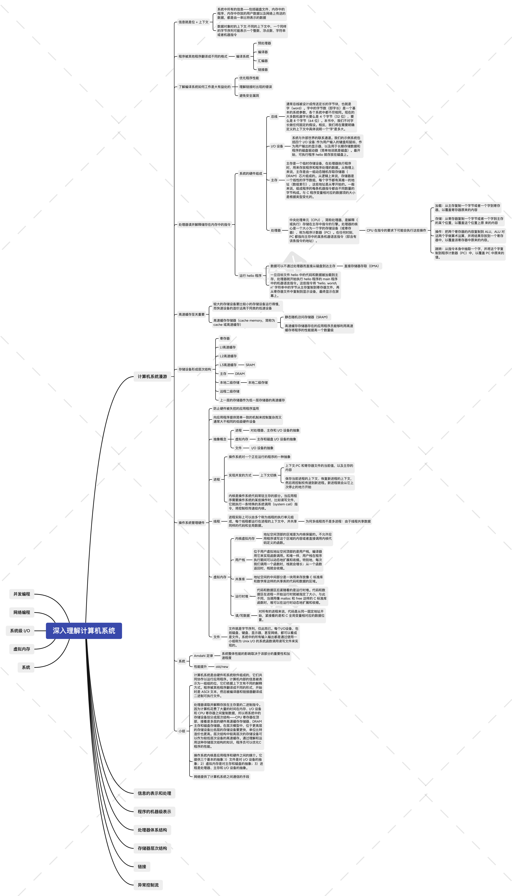
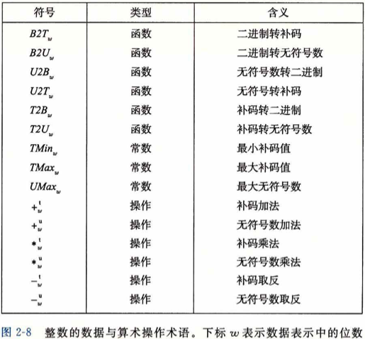

# 从不同角度思考计算机系统
[TOC] 
## 从不同角度看计算机系统
> 对计算机系统的理解:计算机系统是从事IT行业或计算机类专业的同学都会接触到的一个复杂系统，计算机系统是一个通过物理硬件(硬件)及语言构建(软件)组合出来的有机整体来完成信息的计算、存储、IO等等操作从而达到对数字信息处理，通过对软硬件的角度分析可以让我们搞清楚计算机系统是如何设计的，深入了解计算机系统，从系统的角度去看计算机系统，可以让我们搞清楚为什么计算机系统要如此设计。

## Task1
### 软硬件
> 从软、硬件的角度思考:由软硬件的构成的有机整体共同协作而运行程序。在系统内部的信息被表示成一组组的位，他们会根据上下文解释称不同含义，也会通过编译器+链接器翻译成二进制的可执行文件。在硬件中由于CPU快速对主存当中的二进制指令进行读取与解释（如加载、存储、操作、跳转），导致内存、I/O、寄存器之间三者频繁进行数据复制，所以内存当中需要进行分层处理，上层是下层的缓冲区，上层读取速率更快、存储空间更小，利用缓存的方式可以将我们程序的性能获得数量级的提升。为了更好的让用户对物理设备的调用，所以设计出了操作系统(也就是软件，操作系统也是对物理设备的抽象，它主要解决两个问题：1.防止硬件被失控的应用程序滥用 2.向应用程序提供简单一致的机制以此来对复杂的物理硬件进行控制，简单来说就是提供统一的输出与对内部进行封装，保证内部的完整、安全的特性。

#### 一行代码处理过程(自顶向下)

## Task2
### 程序结构和执行
#### 信息的表示和处理
信息的表示与处理这一章节主要讲的是能被机器识别的二进制数字是如何表示有限集合内的元素的，二进制的位通过无符号编码、有符号编码、浮点数编码等等可以做不同方式的计算、被解释成不同的类型。
##### 2.1.1 信息存储
字节: 1个字节占8位，8位的值域在[00000000]~[11111111] 00～FF之间也就是说一个字节能表示0-255个信息
2进制、10进制、16进制的转换: 10进制到16进制->取余数
##### 2.1.2 字数据大小
字长: 字长为w的机器,虚拟地址范围为0~2^w - 1
32位与64位机器的区别: long、char、两者的字节数不同，语言要向下兼容
##### 2.1.3 寻址和字节顺序
对于计算机的存储而言，字节的存储都是连续的字节序列方式进行存储的，对象的地址为当前地址的最小地址，所以通过对象的最小地址来查找当前对象所在的内存空间
##### 2.1.4表示字符串
ASCII码来对二进制数据编码成字符串，如'a'~'Z' 通过二进制编码就是0x61~0x7A
##### 2.1.5表示代码
对于代码而言，程序只是字节序列，在不同的操作系统当中会把程序编译成不同的字节序列，所以我们只要定义对应的指令集就能对起进行编译
##### 2.1.6布尔代数
~、&、｜、^这几种方式可以进行布尔运算，~取反，&且，｜或，^异或
##### 2.1.7c语言的位级运算
对二进制进行位运算
##### 2.1.8c语言的逻辑运算
!、&&、||OR、AND、OR三者运算，做判断结果0x00或者0x01
##### 2.1.9c语言的位移运算
<<左移，位数变大>>右移位数变小
#### 2.2整数运算

##### 2.2.1 整型数据类型
##### 2.2.2
没看完后面再补
### 系统架构
> 从系统架构的角度来说计算机系统就是由通过总线将处理器、主存、I/O设备等等一系列组件互连在一起的集合，在环境中通过暴露出来的接口表现出预期的行为。而计算机系统组件的发展是由于系统的复杂度在不断变化，而系统的复杂度来源有两点：1.需求 2.高利用率。1. 在正常情况下，系统的复杂度会根据需求的数量成指数形式的上涨，利用率也是如此。系统复杂度不断升高会导致系统的扩展性不断下降，以至于需求、利用率等等无法增加。由此从系统的角度来说我们计算机系统当中通过对软硬件的设计需要解决的是系统复杂度、高利用率的问题，解决系统复杂度有四种方式1. 模块化 2.抽象化 3. 层次化4.分级化5.迭代法6.简单性，通过这六种方式首先将系统划分成模块，再把模块组织起来，并且通过总线将他们互连，之后通过名字进行模块之间的调用如处理器去对寄存器当中指令进行读取处理、各个组件之间通过总线进行互连等等，以此来解决延迟决策、模块替换、模块共享等等问题。满足整个系统简单实现后通过迭代法不断去改进，逐渐实现所有功能，通过小步前进、版本反馈、研究错误等等方式对系统不断进行优化达到降低复杂度，控制设计风险等等效果。从系统的角度去看计算机更多的可以看到计算机在工程设计方面的特点，对于软件工程师来说也可以更好的应用在日常工作当中。

#### 计算机系统会遇到的问题

> 从系统的角度思考:  对于一个系统来说都会面临的问题 1.突生属性 2.传播效应 3.扩展不对称 4.权衡。
> 突生属性: 对于系统当中单个组件当中的某些属性，只有在将组件放入整个系统当中之后才展现出来的异常属性，对于这种属性，设计者并不能提前考虑到，但是在系统运行时会产生不必要的资源消耗
> 传播效应：系统当中组件之间的影响是具有整体性质的，也就是一块组件会对另外一块组件产生连锁效应
> 扩展不对称: 随着系统规模在不断扩大，系统当中组件的发展成不同的缩放规则，会产生类似于木桶效应的状况，会受到组件复杂度差异化的影响
> 权衡: 水床效应:对于一个系统来讲，为了提高某一处的性能，很可能会造成另外一处的损失，很多时候为了考虑收益的最大化，需要去思考如何考虑将合适的内容放在最适合他的位置，如何达到资源最优。

#### 复杂度
 占个位，之后总结
#### 解决复杂度的方法
 占个位，之后总结